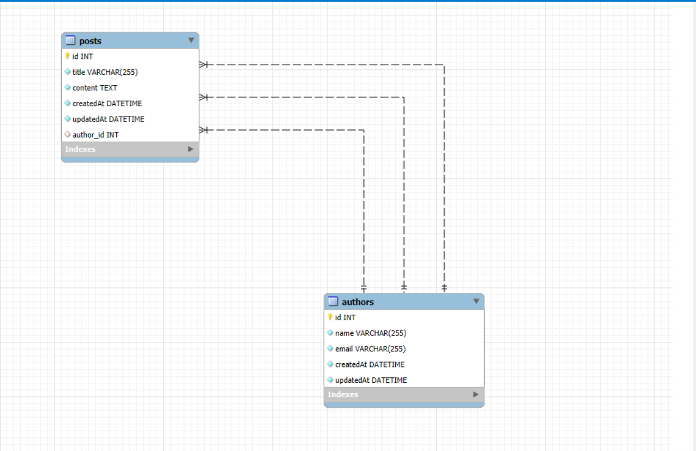

# BLOG PLATFORM REST API

## OVERVIEW
This project is a RESTful API for a simple blog platform that manages **Authors** and **Posts**.  
It demonstrates CRUD operations, one-to-many relationships, foreign key constraints, cascade deletes, and efficient database querying.

The API is built using **Node.js, Express.js, MySQL, and Sequelize ORM**.

---

## TECH STACK
- Node.js  
- Express.js  
- MySQL  
- Sequelize ORM  
- dotenv  
- Postman (for testing)

---

## FEATURES
- Create, read, update, and delete authors
- Create, read, update, and delete posts
- One-to-many relationship between authors and posts
- Foreign key constraints with cascade delete
- Validation for invalid author IDs
- Eager loading to avoid the N+1 query problem

---

## SETUP INSTRUCTIONS

### PREREQUISITES
- Node.js (v16 or later)
- MySQL
- npm

### INSTALLATION STEPS

1. Clone the repository
```bash
git clone https://github.com/23MH1A05M8/Create-a-Blog-API-with-Author-and-Post-Relationships
```

2. Navigate to the project directory
```bash
cd Create-a-Blog-API-with-Author-and-Post-Relationships
```

3. Install dependencies
```bash
npm install
```

4. Create a `.env` file in the root directory
```env
PORT=3000
DB_NAME=blog_db
DB_USER=root
DB_PASSWORD=yourpassword
DB_HOST=localhost
```

5. Create the database in MySQL
```sql
CREATE DATABASE blog_db;
```

6. Start the server
```bash
npm run dev
```
Server runs at: `http://localhost:3000`

---

The database tables are created automatically using **Sequelize models and associations**.

---

## DATABASE SCHEMA

### AUTHORS TABLE
- `id` (Primary Key)
- `name`
- `email` (Unique)
- `createdAt`
- `updatedAt`

### POSTS TABLE
- `id` (Primary Key)
- `title`
- `content`
- `author_id` (Foreign Key → authors.id)
- `createdAt`
- `updatedAt`

### RELATIONSHIP
- One author can have many posts
- Each post belongs to one author
- **ON DELETE CASCADE** ensures posts are deleted when an author is removed

## Database Diagram


---

## API DOCUMENTATION

### AUTHOR ENDPOINTS

#### Create Author
```
POST /authors
```

**Request Body**
```json
{
  "name": "Alice",
  "email": "alice@example.com"
}
```

#### Get All Authors
```
GET /authors
```

#### Get Author by ID
```
GET /authors/:id
```

#### Update Author
```
PUT /authors/:id
```

#### Delete Author
```
DELETE /authors/:id
```
> Deleting an author automatically deletes all related posts.

#### Get Posts by Author
```
GET /authors/:id/posts
```

---

### POST ENDPOINTS

#### Create Post
```
POST /posts
```

**Request Body**
```json
{
  "title": "Post Title",
  "content": "Post Content",
  "author_id": 1
}
```

#### Get All Posts
```
GET /posts
```

#### Get Post by ID
```
GET /posts/:id
```

**Response Example**
```json
{
  "id": 3,
  "title": "Post 2",
  "content": "Content 2",
  "author_id": 5,
  "Author": {
    "name": "Alice",
    "email": "alice@example.com"
  }
}
```

#### Update Post
```
PUT /posts/:id
```

#### Delete Post
```
DELETE /posts/:id
```

---

## RELATIONSHIP HANDLING
- Posts can only be created for existing authors
- Invalid `author_id` returns a 400-level error
- Foreign key constraints enforce data integrity
- Cascade delete removes posts when an author is deleted
- Sequelize eager loading prevents the N+1 query problem

---

## TESTING
- All endpoints tested using Postman
- CRUD operations verified
- Cascade delete behavior verified
- Invalid input handling tested

## Postman Collection (Included)

This project includes a Postman collection for testing.

**How to Use:**
1. Open Postman  
2. Go to Collections  
3. Click **Import**  
4. Select: `Blog-API.postman_collection.json`

---

## CONCLUSION
This project demonstrates a clean REST API design with proper database relationships, efficient querying, and clear documentation.

---

